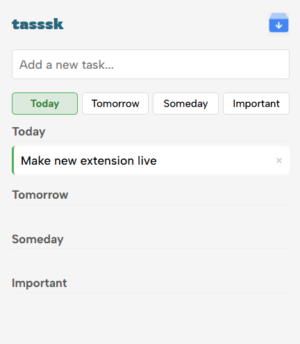
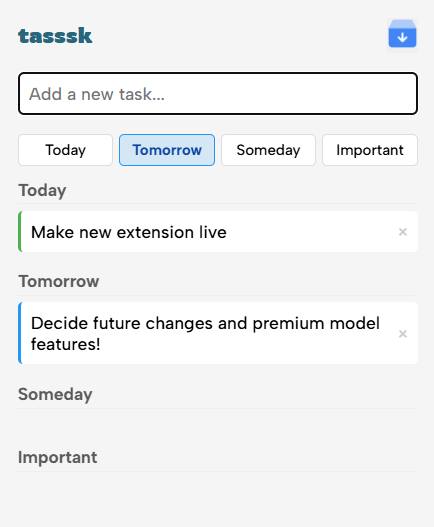
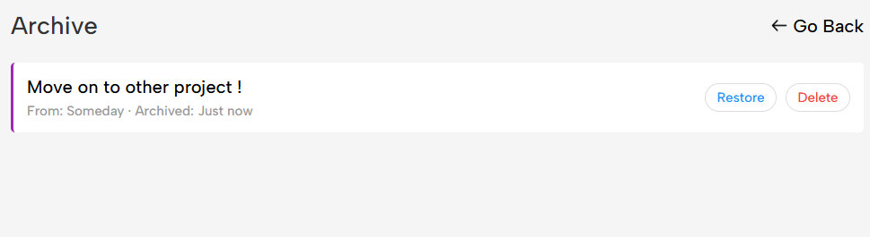
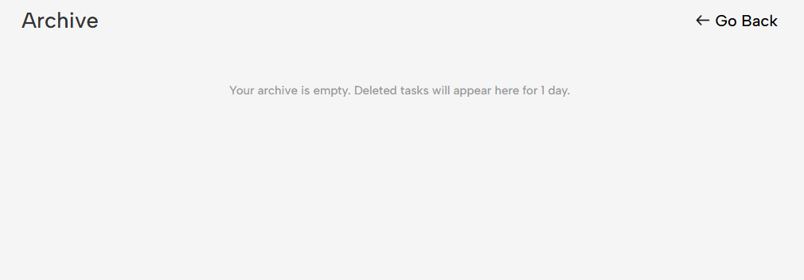

# tasssk
A minimalist yet powerful task management extension designed for productivity-focused users who need an efficient way to organize their daily activities.

## Overview
Tasssk focuses on simplicity without sacrificing functionality. Organize your tasks into intuitive time-based categories - Today, Tomorrow, Someday, and Important - allowing you to prioritize effectively and stay focused on what matters.


## Key Features
- **Clean, distraction-free minimalist interface**
- **Intuitive drag-and-drop functionality** for easy task rearrangement
- **Smart time-based categorization** (Today, Tomorrow, Someday, Important)
- **One-click archiving system** with 24-hour recovery window
- **Instant task creation** with minimal clicks
- **Works offline** with automatic syncing across Chrome instances
- **Zero setup required** - start organizing immediately

## Usage
Live  
- [Chrome Webstore](https://chromewebstore.google.com/detail/tasssk-easy-to-do/mbichoadolaebapgjchcjabljjghcogp)
- [Website](https://tasssk-manager.netlify.app/)
     

1. Click the `tasssk` icon in your Chrome toolbar to open the task manager
2. Add tasks by selecting the task category
3. Organize tasks by dragging and dropping them between categories
4. Mark tasks as complete by clicking the checkbox
5. Edit tasks with the edit button
6. Archive completed tasks with the delete button

## Screenshots

*The clean, minimal interface of TaskFlowX showing all four task categories*



*Creating a new task with just a few clicks*



*Access recently completed tasks in the archive view*


## Project Structure

```
.
└── /tasssk/
    ├── /fonts
    ├── /icons
    ├── /manifest.json
    ├── /archive.html
    ├── /archive.js
    ├── /popup.html
    └── /popup.js
```

## Contact

Pranav Patil- [@thepranavpatil](https://www.linkedin.com/in/thepranavpatil/) - pranavcode010@gmail.com
